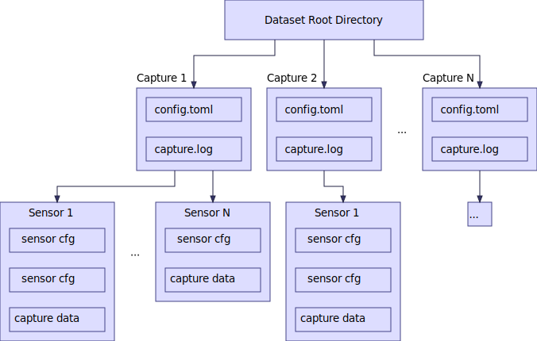
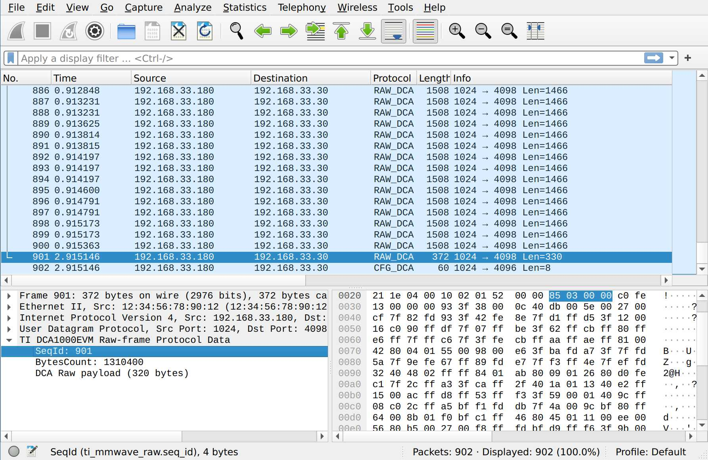
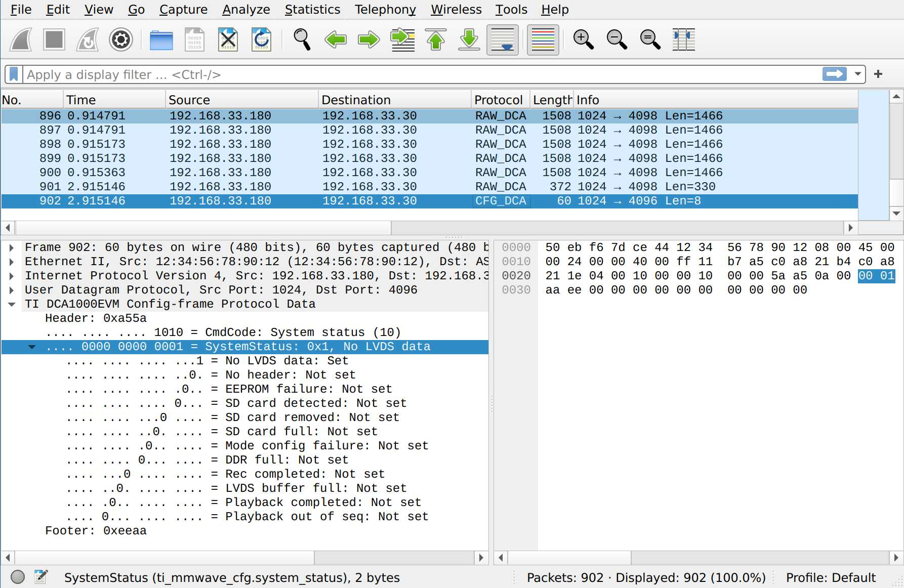

Quickstart
==========

.. image:: _static/quickstart_banner.png
    :scale: 80%
    :align: center

``mmwave-capture-std`` consists of 3 modules: mmwave hardware interface (:class:`~mmwavecapture.radar.Radar`, :class:`~mmwavecapture.dca1000.DCA1000`), data capture and hardware managing (:class:`~mmwavecapture.capture.capture`), and raw data parser (:class:`~mmwavecapture.parser`).

In the following quickstart, we will demonstrate how to use :class:`~mmwavecapture`
to capture raw data from TI IWR1843 radar (IWR1843BOOST) and DCA1000EVM data capture card on Linux.


Prerequisites
-------------

Before we start the quickstart, please make sure you setup the hardware and software environment properly.

Please refer to :doc:`Setup page <setup>` for more details.

For the following quickstart, we assume you have the following hardware setup:

- IWR1843BOOST (Out-of-box demo SDK: 3.6.0)
- DCA1000EVM (FPGA firmware: 2.8)

Millimeter-wave Hardware Interface
----------------------------------

In ``mmwave-capture-std``, :class:`~mmwavecapture.radar.Radar` and :class:`~mmwavecapture.dca1000.DCA1000` only focus on hardware setup, that means the actual data capturing is not done in the millimeter-wave hardware interface.

Communicate with Radar
``````````````````````

Let us start with communicate with the radar, first connect radar USB
cable to your computer, and get the config and port UART path. On
Linux it should be ``/dev/ttyACM0`` and ``/dev/ttyACM1`` respectively.

.. note:: Having trouble to find UART path? See reference: MMWAVE SDK User Guide

A minimum code to communicate with radar will be like this:

.. code-block:: python

    import mmwavecapture.radar

    cfg_file = "tests/configs/xwr18xx_profile_2023_01_01T00_00_00_000.cfg"
    radar = mmwavecapture.radar.Radar(
        config_port="/dev/ttyACM0",
        config_baudrate=115200,
        data_port="/dev/ttyACM1",
        data_baudrate=921600,
        config_filename=cfg_file,
        initialize_connection_and_radar=True,
        capture_frames=100,
    )

    print(radar.get_radar_status())

It should connect to radar UARTs, initialize the radar,
and print out the radar status and data port baudrate:

.. code-block:: bash

    (<RadarStatus.INIT: 0>, 921600)

We can then config the radar as what we provided in ``cfg_file`` and
``capture_frames``:

.. code-block:: python

    radar.config()

If it runs without any error, great! That means we config the radar
correctly and it is ready to start sensing.

Then we can start sensing by calling :meth:`~mmwavecapture.Radar.start_sensor()`

.. code-block:: python

    radar.start_sensor()


Vola, the radar start to sensing!

.. note::

   This module DOES NOT caputre data from radar DSP
   (from :attr:`~mmwavecapture.Radar._data_port`).

Communicate with DCA1000EVM
```````````````````````````

Now, we want to communicate with the DCA1000EVM data capture card via
Ethernet, please connect DCA1000EVM Ethernet to your computer Ethernet interface.

A minimum code to communicate with DCA1000EVM data capture card will be like this:

.. code-block:: python

    import mmwavecapture.dca1000

    dca = mmwavecapture.dca1000.DCA1000()
    print(dca.read_fpga_version())

It should print out the FPGA version of DCA1000EVM data capture card,
it shows our DCA1000EVM FPGA firmware version is 2.8, and it is not in
playback mode:

.. code-block:: bash

    (2, 8, False)

We can then config the DCA1000EVM data capture card:

.. code-block:: python

    dca.system_connection()
    dca.reset_fpga()
    dca.config_fpga()
    dca.config_packet_delay()
    dca.start_record()

Great, now the data capture card is start to capture data from the radar.

.. note::

    After :meth:`~mmwavecapture.dca1000.DCA1000.start_record()` is called,
    the data capture card will start to capture data from radar. But if
    they did not receive any data from radar after 10 seconds, it will
    throw out an ``No LVDS data`` error status and stop capturing data.

    You can observe this by taking a look at the DCA1000EVM data capture
    card status LED, you will see the ``LVDS_PATH_ERR_LED3`` is on (red light).


Capturing Data and Dataset Capture Management
---------------------------------------------

Now we know how to communicate with radar and DCA1000EVM data capture card,
we can then start to capture raw data from radar and DCA1000EVM data capture card.

Unlike other packages, ``mmwave-capture-std`` separate the data capturing from the
millimeter-wave hardware interface, so we have a separate module for data capturing.

Let us see how we can capture data easily with ``mmwave-capture-std`` by
our high-level :class:`~mmwavecapture.capture.CaptureManager`:


.. code-block:: python

   import mmwavecapture.capture

   cm_config_file = "examples/capture_iwr1843.toml"
   cm = mmwavecapture.capture.CaptureManager(cm_config_file)
   cm.init_hw()
   cm.capture()

That's all! Then it should start to capture data from radar and DCA1000EVM data capture card,
with the configuration provided in ``cm_config_file``.

.. code-block:: bash

    ☁  mmwave-capture-std [add-docs] ⚡  poetry run python
    Python 3.10.10 (main, Mar  5 2023, 22:26:53) [GCC 12.2.1 20230201] on linux
    Type "help", "copyright", "credits" or "license" for more information.
    >>> import mmwavecapture.capture
    >>>
    >>> cm_config_file = "examples/capture_iwr1843.toml"
    >>> cm = mmwavecapture.capture.CaptureManager(cm_config_file)
    2023-06-03 13:07:32.093 | INFO     | mmwavecapture.capture.capture:_get_next_capture_dir:276 - Capture ID: 1
    >>> cm.init_hw()
    2023-06-03 13:07:32.098 | INFO     | mmwavecapture.capture.capture:init_hw:281 - Initializing capture hardware `iwr1843` from `mmwavecapture.capture.RadarDCA`
    2023-06-03 13:07:37.504 | SUCCESS  | mmwavecapture.capture.capture:init_hw:296 - Capture hardware `iwr1843` initialized
    2023-06-03 13:07:37.505 | SUCCESS  | mmwavecapture.capture.capture:init_hw:298 - Total of 1 capture hardware initialized
    >>> cm.capture()
    2023-06-03 13:07:44.278 | INFO     | mmwavecapture.capture.capture:capture:309 - Adding capture hardware `iwr1843`
    2023-06-03 13:07:44.278 | INFO     | mmwavecapture.capture.capture:capture:174 - Preparing capture hardware
    2023-06-03 13:07:44.287 | INFO     | mmwavecapture.capture.capture:capture:178 - Starting capture hardware
    2023-06-03 13:07:44.383 | SUCCESS  | mmwavecapture.capture.capture:capture:181 - Capture started
    2023-06-03 13:07:47.457 | INFO     | mmwavecapture.capture.capture:capture:185 - Capture finished
    2023-06-03 13:07:47.457 | INFO     | mmwavecapture.capture.capture:capture:187 - Dumping capture hardware configurations
    2023-06-03 13:07:47.458 | SUCCESS  | mmwavecapture.capture.capture:capture:321 - Capture finished, all files output to `example_dataset/capture_00001/`
    >>>

Yep, capturing data is that easy with ``mmwave-capture-std``.

:class:`~mmwavecapture.capture.CaptureManager` Dataset Directories Structure in ``mmwave-capture-std``
``````````````````````````````````````````````````````````````````````````````````````````````````````

``mmwave-capture-std`` aims at providing a HDF5-like dataset structure for the captured data,
so that it is easy to use and easy to manage for everyone.

The dataset directories structure is like this:



   Dataset directories structure

.. code-block:: bash

    dataset_path/           # Create when initalizing `CaptureManager`
    ├── capture_00000/      # Create when calling `CaptureManager.capture()`
    │   ├── config.toml     # Capture configuration
    │   ├── capture.log     # Capture log
    │   ├── iwr1843_vert/   # Capture hardware name
    │   │   ├── dca.pcap    # DCA1000EVM capture pcap
    │   │   ├── radar.cfg   # Radar configuration
    │   │   ├── dca.json    # DCA1000EVM configuration
    │   ├── realsense/      # Another capture hardware name
    │   │   ├── color.avi   # Color video
    ├── capture_00001/
    │   ├── config.toml
    │   ├── capture.log
    │   ├── iwr1843_vert/
    │   │   ├── dca.pcap
    ...

At each capture directory, there is a ``config.toml`` file, which contains the
capture configuration, a ``capture.log`` includes logging, and a directory for each capture hardware, which contains the hardware configuration and its captured data.


Replicate the capture of a specific dataset capture
```````````````````````````````````````````````````

If you want to replicate the capture of a specific dataset capture, you just
need to run the capture manager with the ``config.toml`` file of that capture.
Easy and simple!

.. note::

   Sure you will need to connect all the hardware to your computer,
   and modify the ``config.toml`` file to match your hardware configuration.
   (e.g. change the radar serial port name, change the IP address of the
   DCA1000EVM, etc.)


Parsing the Captured Raw Millimeter-wave Signal
-----------------------------------------------

In the example configuration, the captured result will be stored in
``example_dataset/capture_00000/``. The layout should be like this:

.. code-block:: bash

    example_dataset/capture_00000/
    ├── config.toml
    ├── capture.log
    ├── iwr1843/
    │   ├── dca.pcap
    │   ├── radar.cfg
    │   ├── dca.json


Let us try to parse the captured raw millimeter-wave signal from pcap file
into a ``numpy.ndarray[numpy.complex64]`` array.

.. code-block:: python

    from mmwavecapture.parser.pcap import PcapCparser

    pcap_file = ("example_dataset/capture_00000/"
                "iwr1843/dca.pcap")
    data_ports = [4098]
    pcap = PcapCparser(
                pcap_file,
                data_ports=data_ports,
                lsb_quadrature=True,
                preprocessing=True)
    for port in data_ports:
        print(pcap.validate_dca_data(port))
        raw_signal = pcap.get_complex(port)
        print(raw_signal.shape)
        print(raw_signal.dtype)
        print(raw_signal[:8])

The output should be like this
(of course the complex numbers will be different):

.. code-block:: bash

    True
    (327680,)
    complex64
    [ 1.6421e+04+6.8000e+01j -5.2000e+01+1.0800e+02j
      1.4000e+01-1.6368e+04j 4.3000e+01+2.6000e+02j
      3.2670e+04+1.6441e+04j -5.3700e+02-2.6200e+02j
      -1.6415e+04+1.6223e+04j  3.2400e+02-4.3900e+02j]

How come the raw data shape is ``(327680,)``?
Let us check the ``radar.cfg`` file:

.. code-block:: bash

   channelCfg 15 5 0
   profileCfg 0 77 429 7 57.14 0 0 70 1 256 5209 0 0 30
   chirpCfg 0 0 0 0 0 0 0 1
   chirpCfg 1 1 0 0 0 0 0 4
   frameCfg 0 1 16 10 100 1 0

This means we have:

- 10 frames
- 2 TX antennas
- 4 RX antennas
- 16 chirps per frame
- 256 samples per chirp

Multiply them we get 327680 (10 * 2 * 4 * 16 * 256), which is the total complex numbers of the raw data!

Debugging the pcap file by Wireshark
------------------------------------

The benefit of using ``tcpdump`` to capture the raw millimeter-wave signal
is that we ensure all the packets are captured, resolve out-of-order packets, having additional information for each packet, and we can use
Wireshark to debug the pcap file.

``mmwave-capture-std`` provides a Wireshark dissector for the DCA1000EVM
raw packet and config packet. You can find the dissector in
``wireshark/dca1000evm_raw.lua``.

To use the dissector, simply type in the following command in your terminal:

.. code-block:: bash

    wireshark -X lua_script:wireshark/dca1000evm_raw.lua \
              example_dataset/capture_00000/iwr1843/dca.pcap

Then you can see the packets in Wireshark:


          sequence ID for this packet is 901, and the
          total bytes (without that packet) sent by the
          data capture card is 1310400 bytes.

    The DCA1000EVM raw packet dissector


          system status packet with No LVDS data flag set.

    The DCA1000EVM config packet dissector


What's Next?
------------

Now you have learned the basic of ``mmwave-capture-std``!

.. Do you want to add your own hardware support? See :ref:`Adding new hardware support <adding_new_hardware_support>`.
